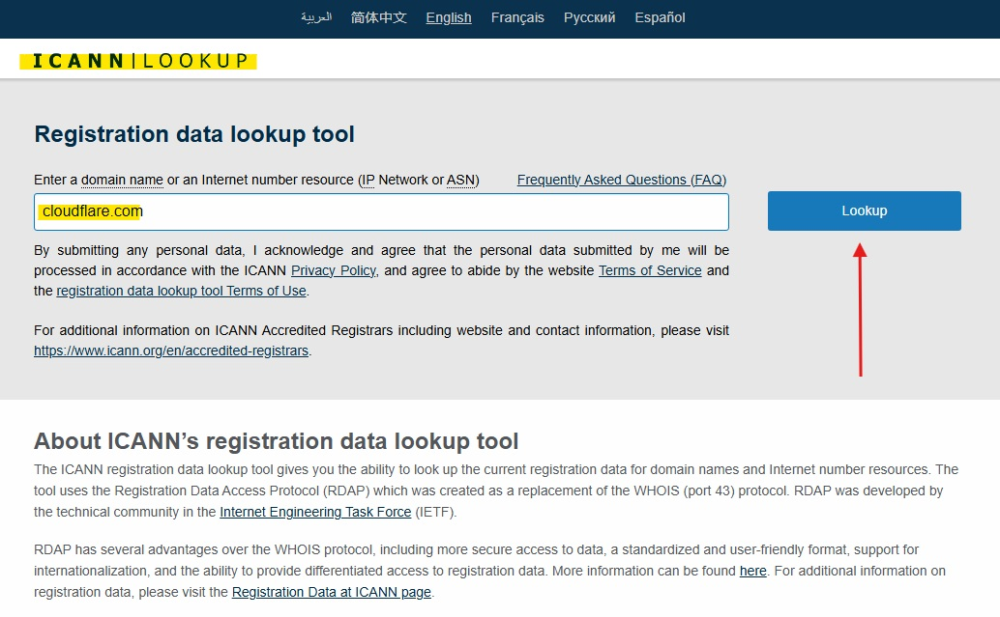
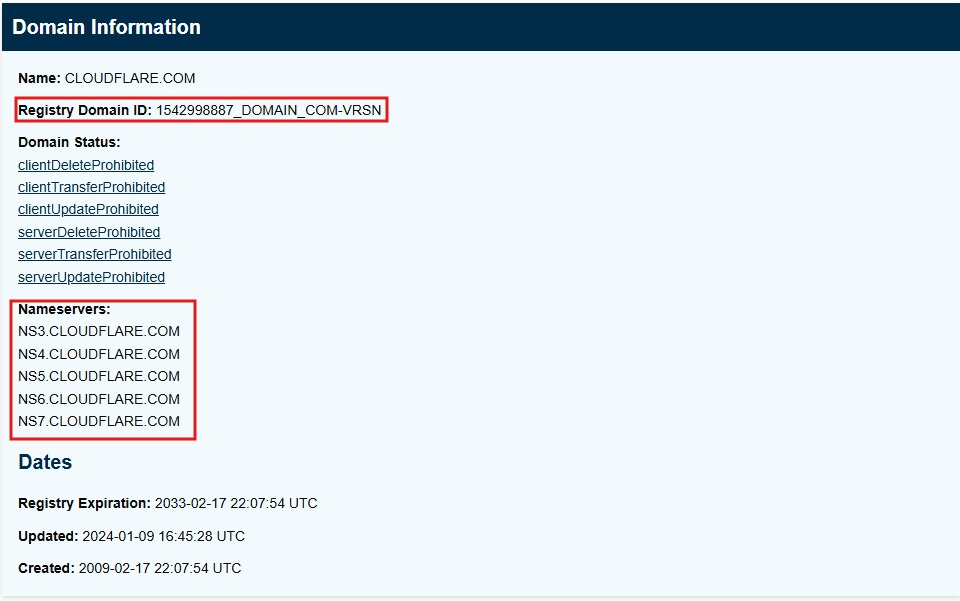
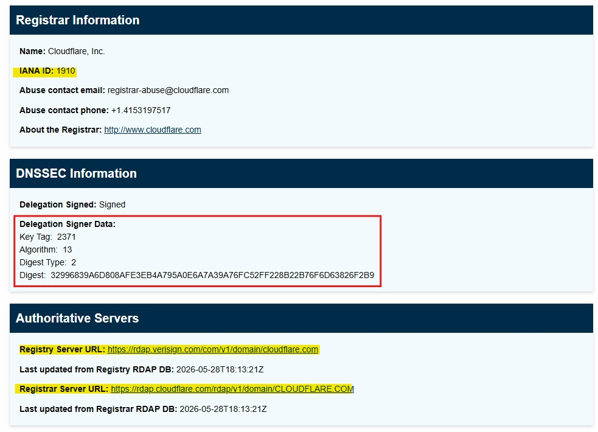
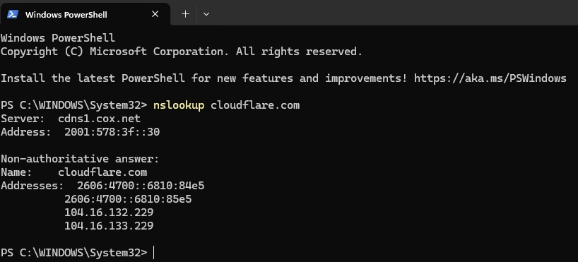
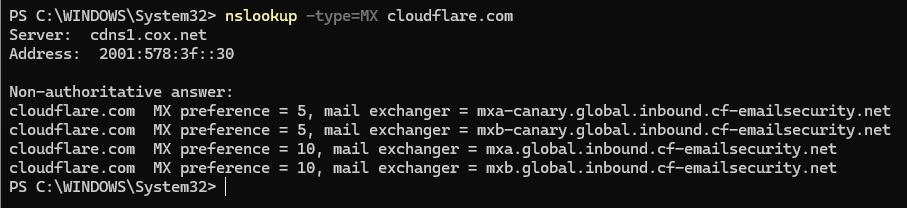
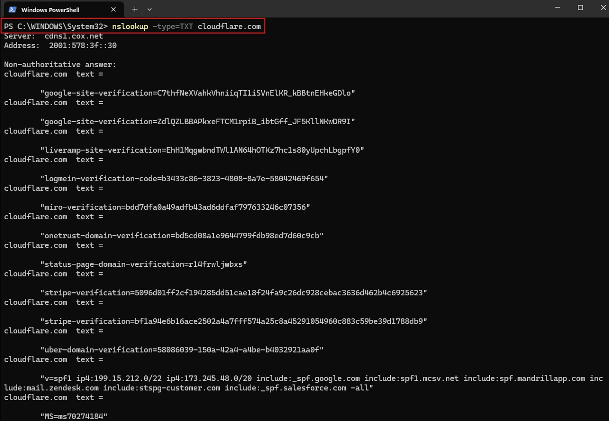
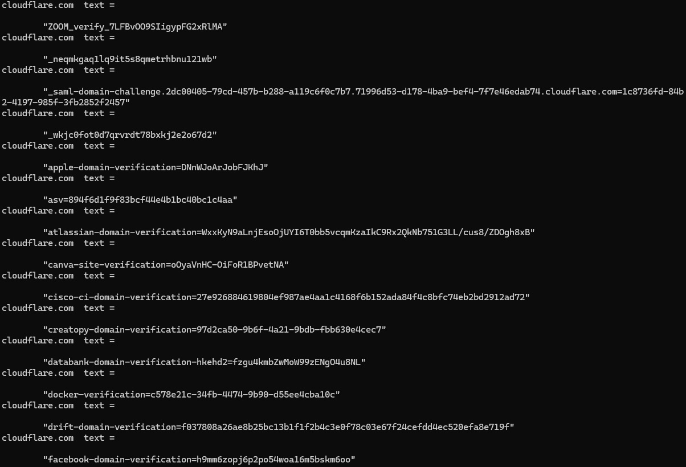
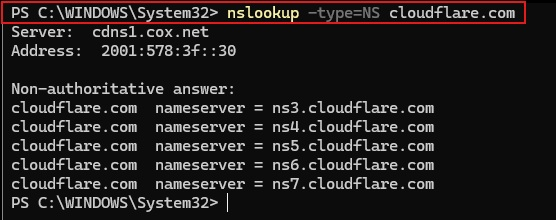
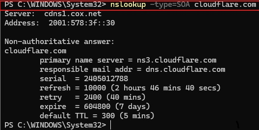
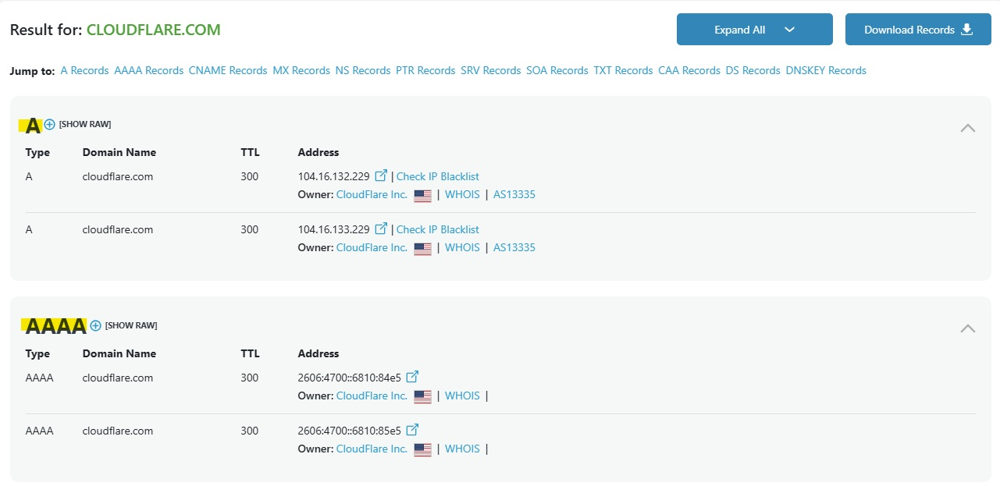

# 02 - Domain Investigation

```markdown
<p align="center">
  
</p>
```

## Objective

The objective of this section is to perform a basic OSINT investigation on a public domain using safe, passive research methods.

This step focuses on identifying publicly available domain information, including registration details, DNS records, name servers, mail records, and other metadata that may help support a cybersecurity investigation.

## Why This Matters

Domain investigation is commonly used during SOC triage, phishing analysis, threat intelligence research, and incident response.

When analysts investigate a suspicious domain, they may need to determine:

- Who registered the domain
- When the domain was created or updated
- What name servers are used
- What mail servers are associated with the domain
- Whether the domain has suspicious or unusual characteristics
- Whether the domain appears in reputation or threat intelligence sources

## Tools Used

- ICANN Lookup
- WHOIS / RDAP
- nslookup
- DNSChecker
- VirusTotal

## Investigation Target

For this project, the domain selected for investigation is:

```text
cloudflare.com

This domain was selected because Cloudflare is a well-known internet infrastructure and cybersecurity company. Its public domain footprint provides useful examples for practicing passive OSINT techniques, including domain registration review, DNS analysis, certificate transparency research, and reputation enrichment.

All research performed in this project will be passive and limited to publicly available sources. No exploitation, intrusive scanning, authentication bypass, or unauthorized access will be attempted.

## Investigation Questions

This domain investigation will attempt to answer the following questions:

- What public registration information is available for the domain?
- What DNS records are associated with the domain?
- What name servers are used?
- What mail servers are associated with the domain?
- What subdomains or certificates are publicly visible?
- Does the domain appear suspicious based on public OSINT sources?

## ICANN Lookup Findings

The ICANN Lookup results provided public registration and RDAP information for `cloudflare.com`.

### Screenshot 1 - ICANN Lookup Search



The domain `cloudflare.com` was searched using ICANN Lookup, which provides public registration data through RDAP.

### Screenshot 2 - Domain Information



The domain information revealed the following details:

| Field | Finding |
|---|---|
| Domain | CLOUDFLARE.COM |
| Registry Domain ID | 1542998887_DOMAIN_COM-VRSN |
| Created | 2009-02-17 22:07:54 UTC |
| Updated | 2024-01-09 16:45:28 UTC |
| Registry Expiration | 2033-02-17 22:07:54 UTC |
| Domain Status | Client and server-level delete, transfer, and update protections enabled |
| Nameservers | NS3.CLOUDFLARE.COM, NS4.CLOUDFLARE.COM, NS5.CLOUDFLARE.COM, NS6.CLOUDFLARE.COM, NS7.CLOUDFLARE.COM |

### Screenshot 3 - Registrar, DNSSEC, and Authoritative Server Information



The registrar information showed that the domain is registered through Cloudflare, Inc. The domain also has DNSSEC enabled, which indicates that DNS responses can be cryptographically validated.

### Analyst Notes

The ICANN Lookup results show that `cloudflare.com` has a mature and well-established registration profile. The domain was created in 2009 and has an expiration date extending to 2033, which is consistent with a legitimate long-term organization.

The domain also uses multiple Cloudflare-controlled nameservers and has several domain protection statuses enabled. These status values help prevent unauthorized deletion, transfer, or modification of the domain.

DNSSEC is also enabled, which improves DNS integrity by helping protect against certain DNS spoofing and tampering attacks.

Overall, the ICANN/RDAP results do not indicate suspicious registration behavior. The domain appears consistent with a legitimate, established cybersecurity and internet infrastructure company.

## Basic DNS Resolution with nslookup

After reviewing ICANN registration information, the next step was to perform a basic DNS lookup using `nslookup`.

This helped identify the public IP addresses that `cloudflare.com` resolved to at the time of the query.

### Command Used

```powershell
nslookup cloudflare.com
```

### Screenshot - Basic Domain Query



### Results Observed

The domain resolved to both IPv6 and IPv4 addresses.

| Record Type | Resolved Address |
|---|---|
| IPv6 | 2606:4700::6810:84e5 |
| IPv6 | 2606:4700::6810:85e5 |
| IPv4 | 104.16.132.229 |
| IPv4 | 104.16.133.229 |

The DNS query was answered by the local configured resolver:

```text
cdns1.cox.net
```

### Analyst Notes

The `nslookup` results show that `cloudflare.com` resolves to multiple public IP addresses. The presence of both IPv4 and IPv6 records is expected for a large internet infrastructure company.

Multiple resolved addresses can support redundancy, traffic distribution, and high availability. In a SOC investigation, this type of DNS lookup helps analysts identify infrastructure associated with a domain and provides IP addresses that can be enriched further using reputation and threat intelligence tools.

## Mail Exchange (MX) Record Lookup

The next DNS query reviewed the mail exchange (MX) records for `cloudflare.com`.

MX records identify the mail servers responsible for receiving email on behalf of a domain. In cybersecurity investigations, MX records can help analysts understand how a domain handles email and whether the mail infrastructure appears legitimate or suspicious.

### Command Used

```powershell
nslookup -type=MX cloudflare.com
```

### Screenshot - MX Record Query



### Results Observed

The query returned the following MX records:

| Priority | Mail Exchanger |
|---|---|
| 5 | mxa-canary.global.inbound.cf-emailsecurity.net |
| 5 | mxb-canary.global.inbound.cf-emailsecurity.net |
| 10 | mxa.global.inbound.cf-emailsecurity.net |
| 10 | mxb.global.inbound.cf-emailsecurity.net |

### Analyst Notes

The MX lookup showed that `cloudflare.com` uses Cloudflare-controlled email security infrastructure for inbound mail handling.

The presence of multiple MX records with different priority values supports redundancy and availability. Lower preference values are attempted first, so the records with priority `5` would generally be preferred before the records with priority `10`.

From a SOC perspective, reviewing MX records can help determine whether a domain's email infrastructure aligns with the expected organization. Suspicious domains may use unusual, recently created, or mismatched mail infrastructure. In this case, the MX records are consistent with Cloudflare's own email security services.

## TXT Record Lookup

The next DNS query reviewed the TXT records for `cloudflare.com`.

TXT records are flexible DNS records that can store text-based information for a domain. In cybersecurity and email security investigations, TXT records are often reviewed for SPF policies, domain verification records, third-party service validation, and other security-related metadata.

### Command Used

```powershell
nslookup -type=TXT cloudflare.com
```

### Screenshots - TXT Record Query





### Results Observed

The TXT record lookup returned multiple records associated with domain and service verification. Examples observed included:

| TXT Record Type | Example Observed |
|---|---|
| Google site verification | google-site-verification |
| SPF email policy | v=spf1 |
| Microsoft verification | MS=ms70274184 |
| Zoom verification | ZOOM_verify |
| Apple domain verification | apple-domain-verification |
| Atlassian domain verification | atlassian-domain-verification |
| Canva site verification | canva-site-verification |
| Cisco CI domain verification | cisco-ci-domain-verification |
| Docker verification | docker-verification |
| Facebook domain verification | facebook-domain-verification |

The SPF record was especially relevant because SPF is used to define which mail sources are authorized to send email on behalf of the domain.

### Analyst Notes

The TXT lookup showed that `cloudflare.com` has many third-party service verification records. This is normal for a large organization that uses multiple cloud services, collaboration tools, marketing platforms, and security integrations.

The presence of an SPF record is important from an email security perspective. SPF helps reduce email spoofing by identifying authorized mail-sending sources for the domain. During phishing investigations, analysts often review TXT records to determine whether a suspicious sender domain has proper email authentication controls configured.

From an OSINT perspective, TXT records can reveal useful public information about the services a company uses. However, these findings should be interpreted carefully. A TXT verification record does not necessarily mean a service is actively used in a sensitive way; it only indicates that the domain has been configured to verify ownership or authorize a related service.

## Nameserver (NS) Record Lookup

The next DNS query reviewed the nameserver (NS) records for `cloudflare.com`.

NS records identify the authoritative nameservers responsible for answering DNS queries for a domain. In cybersecurity investigations, NS records can help analysts determine whether a domain is using expected infrastructure or whether it points to suspicious, unusual, or recently changed DNS providers.

### Command Used

```powershell
nslookup -type=NS cloudflare.com
```

### Screenshot - NS Record Query



### Results Observed

The query returned the following authoritative nameservers:

| Nameserver |
|---|
| ns3.cloudflare.com |
| ns4.cloudflare.com |
| ns5.cloudflare.com |
| ns6.cloudflare.com |
| ns7.cloudflare.com |

### Analyst Notes

The NS lookup showed that `cloudflare.com` uses multiple Cloudflare-controlled nameservers. This is expected because the domain belongs to Cloudflare and is using its own authoritative DNS infrastructure.

Multiple nameservers provide redundancy and resiliency. If one nameserver is unavailable, other authoritative nameservers can continue responding to DNS queries.

From a SOC and OSINT perspective, nameserver review is useful because suspicious domains may use unusual DNS providers, recently changed nameservers, or infrastructure that does not align with the claimed organization. In this case, the nameserver results are consistent with a legitimate Cloudflare-owned domain.

## Start of Authority (SOA) Record Lookup

The next DNS query reviewed the Start of Authority (SOA) record for `cloudflare.com`.

An SOA record contains administrative information about a DNS zone. This can include the primary authoritative nameserver, responsible party, serial number, refresh interval, retry interval, expiration value, and default TTL.

### Command Used

```powershell
nslookup -type=SOA cloudflare.com
```

### Screenshot - SOA Record Query



### Results Observed

The SOA lookup returned the following DNS zone information:

| Field | Value |
|---|---|
| Primary Name Server | ns3.cloudflare.com |
| Responsible Mail Address | dns.cloudflare.com |
| Serial | 2405012788 |
| Refresh | 10000 seconds |
| Retry | 2400 seconds |
| Expire | 604800 seconds |
| Default TTL | 300 seconds |

### Analyst Notes

The SOA record shows that `ns3.cloudflare.com` is listed as the primary nameserver for the domain's DNS zone. The responsible mail address is listed as `dns.cloudflare.com`, which is consistent with Cloudflare-managed DNS administration.

The timing values help control how DNS zone data is refreshed and cached. The default TTL of 300 seconds, or 5 minutes, indicates that DNS responses may be cached for a relatively short period of time before clients or resolvers check again for updated records.

From an OSINT and SOC perspective, SOA records help analysts understand basic DNS zone administration. Suspicious or misconfigured domains may show unusual primary nameservers, unexpected responsible mail addresses, or DNS settings that do not align with the claimed organization. In this case, the SOA record appears consistent with a legitimate Cloudflare-owned domain.

## DNSChecker Web-Based DNS Review

After performing command-line DNS lookups with `nslookup`, DNSChecker was used to review DNS records from a web-based OSINT tool.

Using both command-line and web-based tools helps validate findings and provides clearer screenshots for documentation.

### Tool Used

```text
DNSChecker - All DNS Records
```

### Target Queried

```text
cloudflare.com
```

### Screenshot - DNSChecker DNS Record Results



### Results Observed

The DNSChecker results displayed DNS records for `cloudflare.com`, including A and AAAA records.

| Record Type | Example Result |
|---|---|
| A | 104.16.132.229 |
| A | 104.16.133.229 |
| AAAA | 2606:4700::6810:84e5 |
| AAAA | 2606:4700::6810:85e5 |
| TTL | 300 seconds |
| Owner | Cloudflare Inc. |
| ASN | AS13335 |

### Analyst Notes

The DNSChecker results confirmed the earlier `nslookup` findings by showing both IPv4 and IPv6 records for `cloudflare.com`.

The records also showed Cloudflare ownership and ASN information. ASN, or Autonomous System Number, is useful in OSINT investigations because it helps identify the network provider or organization associated with IP infrastructure.

The observed TTL value of 300 seconds matches the short caching behavior seen in the SOA lookup. This is expected for a major internet infrastructure provider that may need flexible and responsive DNS behavior.

Overall, the DNSChecker review supports the earlier command-line findings and confirms that the observed DNS records align with Cloudflare-owned infrastructure.


