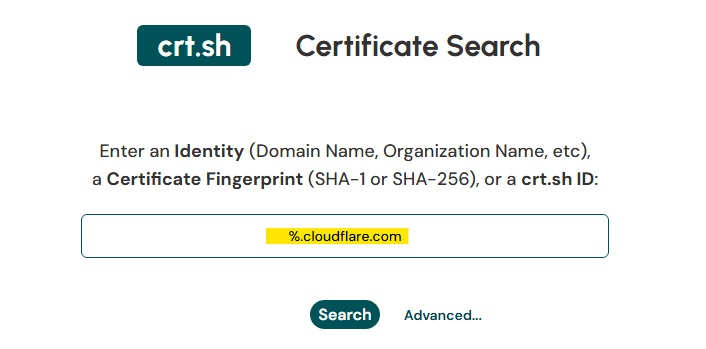
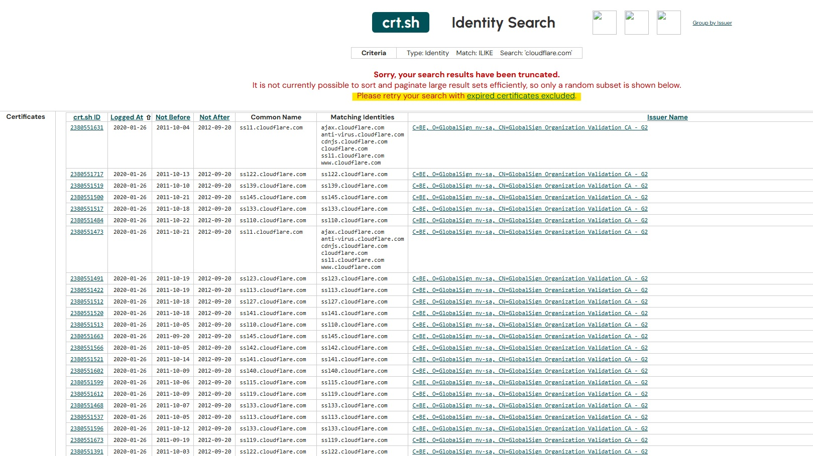

# 03 - Certificate Transparency

```markdown
<p align="center">
  
</p>
```

## Objective

The objective of this section is to use Certificate Transparency (CT) logs to identify publicly visible certificates and related domain names associated with `cloudflare.com`.

Certificate Transparency logs are public records of TLS/SSL certificates issued by certificate authorities. These logs can help analysts discover subdomains, historical certificates, certificate issuers, and related identities connected to a domain.

## Why This Matters

Certificate Transparency is useful in OSINT, SOC triage, and threat intelligence because it can reveal public-facing infrastructure that may not be obvious from basic DNS lookups alone.

Analysts may use CT logs to:

- Identify subdomains associated with a target domain
- Review certificate issuance history
- Identify certificate authorities used by an organization
- Discover historical or legacy infrastructure
- Support phishing or impersonation investigations
- Compare expected certificates against suspicious lookalike domains

## Tool Used

```text
crt.sh
```

## Search Query

```text
%.cloudflare.com
```

The wildcard query was used to search for certificates and identities associated with subdomains of `cloudflare.com`.

## Screenshot 1 - crt.sh Wildcard Search



The wildcard search was entered into crt.sh to identify certificate records related to `cloudflare.com` and its subdomains.

## Screenshot 2 - Truncated Certificate Results



The results showed that the search returned a very large number of certificate records. crt.sh displayed a warning that the results were truncated, meaning only a subset of matching certificate records was shown.

## Results Observed

The visible results included certificate records associated with Cloudflare-related hostnames and subdomains, such as:

| Observed Field | Example |
|---|---|
| Common Name | ssl1.cloudflare.com |
| Matching Identity | ajax.cloudflare.com |
| Matching Identity | anti-virus.cloudflare.com |
| Matching Identity | cdnjs.cloudflare.com |
| Matching Identity | cloudflare.com |
| Matching Identity | www.cloudflare.com |
| Issuer | GlobalSign Organization Validation CA |

## Analyst Notes

The crt.sh results show that `cloudflare.com` has a large certificate history, which is expected for a major internet infrastructure and cybersecurity company.

The visible certificate records revealed multiple Cloudflare-related identities and subdomains. This demonstrates how Certificate Transparency logs can help analysts discover public-facing names and historical certificate data associated with an organization.

The result truncation is also an important finding. Large organizations may have thousands of certificate records, which can make broad wildcard searches difficult to review manually. In a real investigation, an analyst may need to narrow the search by excluding expired certificates, filtering by issuer, reviewing specific certificate IDs, or exporting results for structured analysis.

During this investigation, attempting to narrow the search by excluding expired certificates resulted in a temporary `502 Bad Gateway` error from crt.sh. Because of that, the investigation continued using the original wildcard search and the visible truncated results.

Overall, the Certificate Transparency review confirmed that CT logs are a valuable OSINT source for discovering domain-related certificate records, subdomains, and historical infrastructure.
