# 04 - IP Reputation Analysis

```markdown
<p align="center">
  
</p>
```

## Objective

The objective of this section is to perform IP reputation analysis on a public IP address associated with `cloudflare.com`.

IP reputation analysis helps cybersecurity analysts determine whether an IP address has been associated with malicious activity, suspicious communications, malware, phishing, spam, or other threat intelligence indicators.

## Why This Matters

In SOC triage and incident response, analysts often investigate IP addresses found in alerts, firewall logs, DNS logs, proxy logs, EDR telemetry, phishing reports, or SIEM events.

IP reputation tools can help analysts:

- Determine whether an IP address is known to be malicious
- Identify the organization or ASN associated with the IP
- Review vendor detection results
- Check community reputation
- Support allow/block/escalation decisions
- Enrich indicators of compromise during an investigation

## Tool Used

```text
VirusTotal
```

## Target Queried

```text
104.16.132.229
```

This IP address was selected because it appeared during the earlier DNS resolution of `cloudflare.com`.

## Screenshot 1 - VirusTotal IP Search

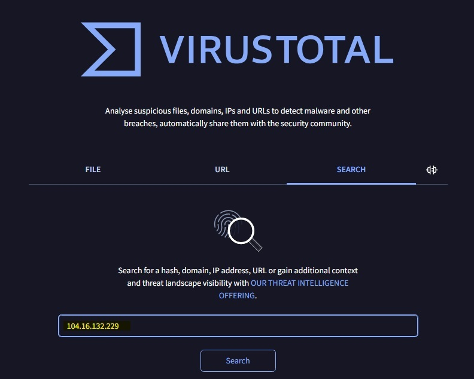

The IP address `104.16.132.229` was searched in VirusTotal to review public reputation and threat intelligence information.

## Screenshot 2 - VirusTotal Detection Summary

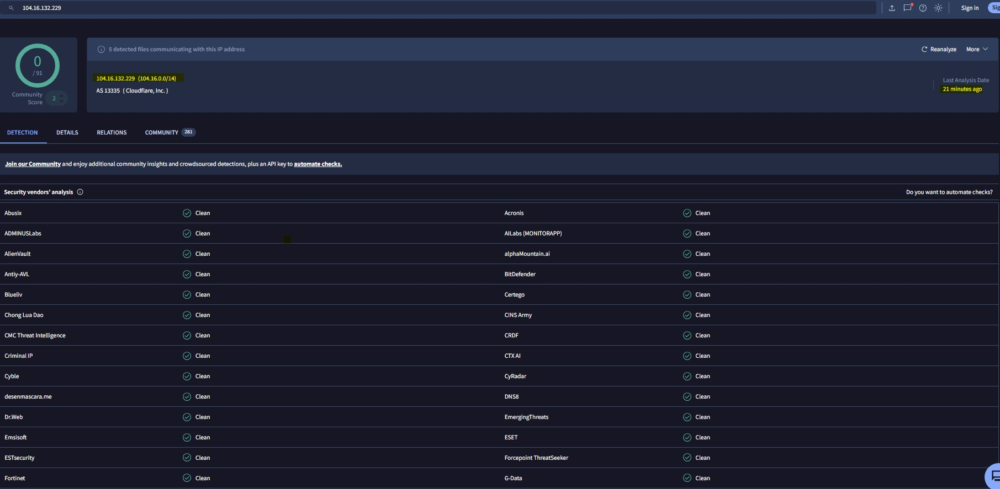

The VirusTotal results showed that the IP address was associated with Cloudflare infrastructure.

### Key Observations

| Field | Finding |
|---|---|
| IP Address | 104.16.132.229 |
| Network Range | 104.16.0.0/14 |
| ASN | AS13335 |
| Organization | Cloudflare, Inc. |
| Detection Result | 0 / 91 security vendors flagged the IP as malicious |
| Last Analysis | Recently analyzed at the time of investigation |

## Screenshot 3 - Vendor Reputation Results

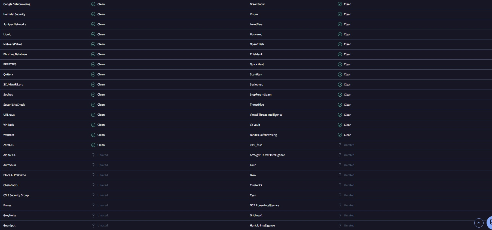

The vendor results showed that the visible security vendors marked the IP address as clean or unrated. No malicious detections were observed in the captured results.

## Analyst Notes

The VirusTotal review did not show malicious reputation indicators for `104.16.132.229` at the time of the investigation. The IP address was associated with Cloudflare, Inc. and AS13335, which aligns with the DNS results collected earlier.

The `0 / 91` detection result suggests that no participating VirusTotal security vendors flagged the IP address as malicious during the reviewed analysis period.

From a SOC perspective, this type of IP enrichment helps analysts determine whether an observed IP address is suspicious, benign, or expected based on the surrounding context. Reputation alone should not be treated as final proof, but it is useful supporting evidence during alert triage.

In this case, the IP address appears consistent with legitimate Cloudflare infrastructure and does not show suspicious reputation indicators in VirusTotal.

## AbuseIPDB IP Reputation Review

After reviewing the IP address in VirusTotal, AbuseIPDB was used as a second reputation source for `104.16.132.229`.

AbuseIPDB is a public IP reputation platform that allows users to check whether an IP address has been reported for abusive behavior such as scanning, brute force attempts, spam, phishing, or other suspicious activity.

## Tool Used

```text
AbuseIPDB
```

## Target Queried

```text
104.16.132.229
```

## Screenshot 1 - AbuseIPDB Search

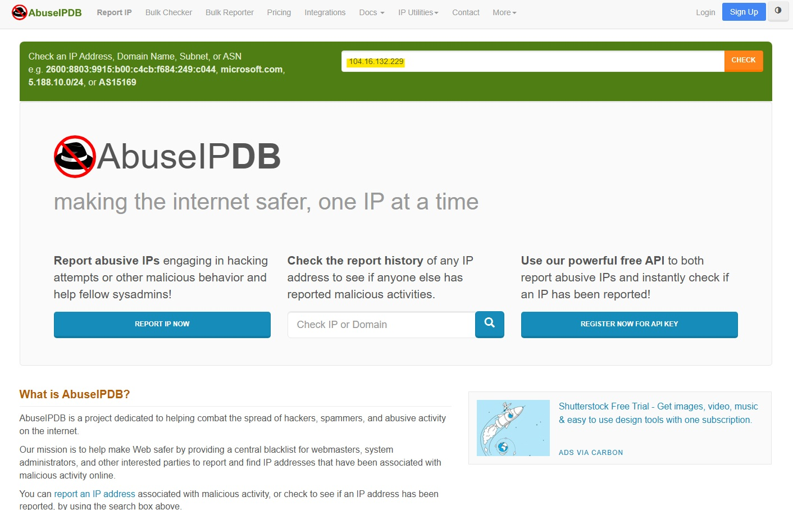

The IP address was searched in AbuseIPDB to review public abuse reports, confidence score, ownership details, and related reputation information.

## Screenshot 2 - AbuseIPDB Reputation Summary

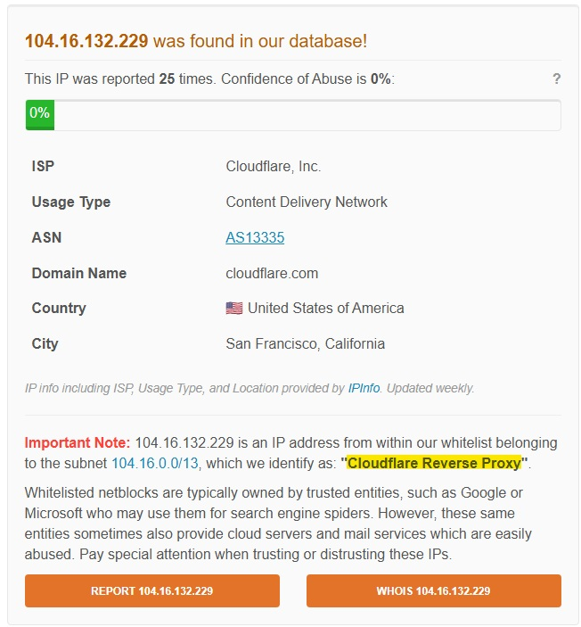

### Key Observations

| Field | Finding |
|---|---|
| IP Address | 104.16.132.229 |
| Report Count | 25 reports |
| Confidence of Abuse | 0% |
| ISP | Cloudflare, Inc. |
| Usage Type | Content Delivery Network |
| ASN | AS13335 |
| Domain Name | cloudflare.com |
| Country | United States |
| City | San Francisco, California |
| Note | Identified as part of a Cloudflare Reverse Proxy subnet |

## Screenshot 3 - Abuse Report History

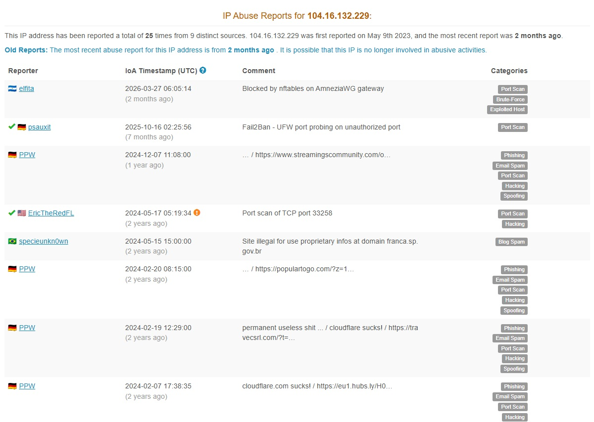

The abuse report history showed that the IP address had been reported 25 times from 9 distinct sources. The visible report categories included examples such as port scan, brute force, phishing, email spam, hacking, spoofing, and exploited host.

AbuseIPDB also noted that the most recent report was old enough that the IP may no longer be involved in abusive activity.

## Analyst Notes

The AbuseIPDB results add important context to the VirusTotal results. While VirusTotal showed no malicious detections, AbuseIPDB showed that the IP address had historical abuse reports.

However, the AbuseIPDB confidence of abuse was `0%`, and the IP was identified as part of a Cloudflare reverse proxy subnet. This distinction matters because shared infrastructure, proxy services, CDNs, and hosting providers may appear in abuse reports due to activity from customers or traffic passing through the provider's network.

From a SOC perspective, this is a good example of why analysts should not rely on a single data point. A reported IP address does not automatically mean the organization that owns the IP is malicious. Analysts should evaluate the confidence score, report age, usage type, ASN, ownership, and surrounding telemetry before making a decision.

In this case, the AbuseIPDB findings suggest that `104.16.132.229` has historical reports, but the confidence score, ownership, and context indicate that it is likely legitimate Cloudflare infrastructure rather than a confirmed malicious indicator.

## Shodan IP Intelligence Review

After reviewing `104.16.132.229` in VirusTotal and AbuseIPDB, Shodan was used to review public internet-exposed service intelligence for the same IP address.

Shodan is an internet-connected device and service search engine. In cybersecurity investigations, it can help analysts identify exposed ports, observed services, hostnames, certificates, web technologies, and other public-facing infrastructure details.

## Tool Used

```text
Shodan
```

## Target Queried

```text
104.16.132.229
```

## Screenshot 1 - Shodan IP Search

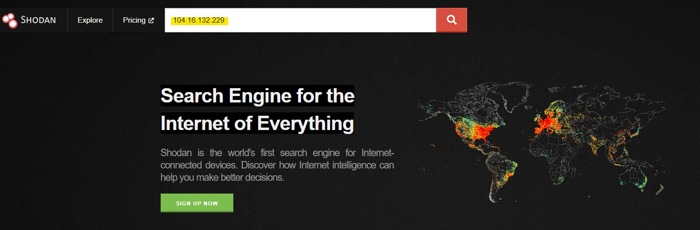

The IP address `104.16.132.229` was searched in Shodan to identify publicly visible service and host information.

## Screenshot 2 - General Information and Open Ports

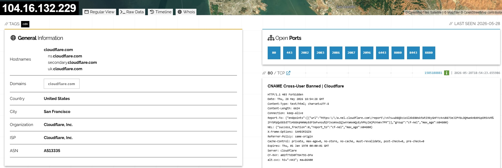

### Key Observations

| Field | Finding |
|---|---|
| IP Address | 104.16.132.229 |
| Organization | Cloudflare, Inc. |
| ISP | Cloudflare, Inc. |
| ASN | AS13335 |
| Country | United States |
| City | San Francisco |
| Tags | CDN |
| Hostnames | cloudflare.com, ns.cloudflare.com, secondary.cloudflare.com, uk.cloudflare.com |

Shodan also identified multiple open ports.

| Open Ports Observed |
|---|
| 80 |
| 443 |
| 2082 |
| 2083 |
| 2086 |
| 2087 |
| 2096 |
| 6443 |
| 8080 |
| 8443 |
| 8880 |

## Screenshot 3 - Web Technologies and HTTP Response Data

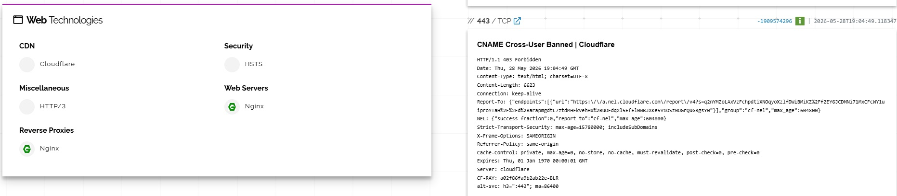

The Shodan results showed web technology and HTTP response information, including:

| Category | Observation |
|---|---|
| CDN | Cloudflare |
| Security | HSTS |
| Reverse Proxy | Nginx |
| Web Server | Nginx |
| HTTP Response | 403 Forbidden observed on some services |
| Server Header | cloudflare |

The `403 Forbidden` responses indicate that some services are reachable but access is restricted. This is common for protected or controlled web services and does not automatically indicate malicious activity.

## Screenshot 4 - Additional Ports and SSL Certificate Details

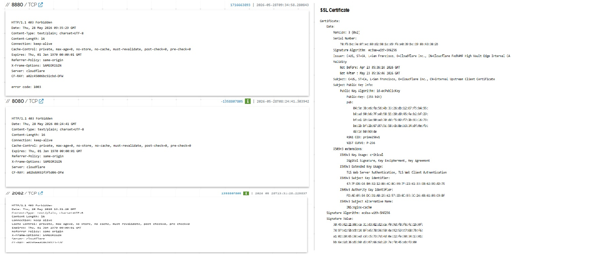

Additional Shodan output showed service response data and SSL certificate details. The visible certificate information was associated with Cloudflare-related certificate data.

## Analyst Notes

The Shodan review provided useful public-facing infrastructure context for `104.16.132.229`. The IP address was associated with Cloudflare, Inc., AS13335, and CDN-related infrastructure, which aligns with the earlier DNS, VirusTotal, and AbuseIPDB findings.

The presence of multiple open ports is expected for Cloudflare infrastructure because Cloudflare supports several web service ports commonly used for HTTP, HTTPS, and alternate web traffic.

The Shodan results also showed web technology indicators such as Cloudflare, Nginx, HSTS, and reverse proxy behavior. These findings are consistent with an internet infrastructure and content delivery network provider.

From a SOC perspective, Shodan is useful for understanding what is publicly visible about an IP address. However, open ports alone are not enough to classify an IP as suspicious. Analysts should interpret exposed services alongside ownership, reputation, ASN, certificate information, and related telemetry.

In this case, the Shodan findings support the conclusion that `104.16.132.229` is legitimate Cloudflare infrastructure with public web-facing services.

## Censys IP Intelligence Review

After reviewing `104.16.132.229` in VirusTotal, AbuseIPDB, and Shodan, Censys was used as another public internet intelligence source.

Censys helps analysts review public host, service, protocol, certificate, and exposure data. In OSINT and security operations, this can help validate whether an IP address is associated with expected infrastructure and identify visible services.

## Tool Used

```text
Censys
```

## Target Queried

```text
104.16.132.229
```

## Screenshot 1 - Censys IP Search

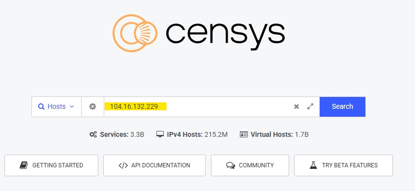

The IP address was searched in Censys to review publicly visible host and service information.

## Screenshot 2 - Censys Host Results

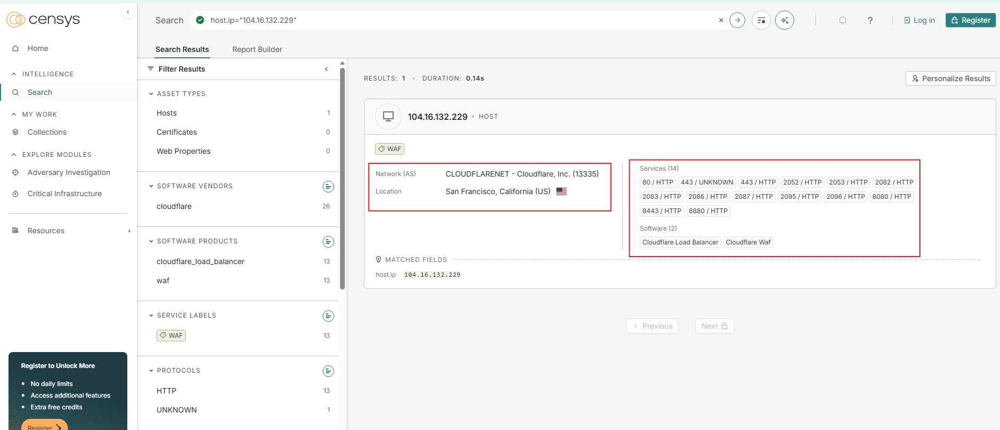

### Key Observations

| Field | Finding |
|---|---|
| IP Address | 104.16.132.229 |
| Network / AS | CLOUDFLARENET - Cloudflare, Inc. (AS13335) |
| Location | San Francisco, California, United States |
| Asset Type | Host |
| Service Label | WAF |
| Software Vendor | cloudflare |
| Software Products | Cloudflare Load Balancer, Cloudflare WAF |
| Protocols Observed | HTTP and UNKNOWN |
| Services Observed | 14 services |

### Services Observed

Censys showed multiple services associated with the host, including:

| Port / Protocol |
|---|
| 80 / HTTP |
| 443 / HTTP |
| 443 / UNKNOWN |
| 2052 / HTTP |
| 2053 / HTTP |
| 2082 / HTTP |
| 2083 / HTTP |
| 2086 / HTTP |
| 2087 / HTTP |
| 2095 / HTTP |
| 2096 / HTTP |
| 8080 / HTTP |
| 8443 / HTTP |
| 8880 / HTTP |

## Analyst Notes

The Censys results confirmed that `104.16.132.229` is associated with Cloudflare infrastructure under AS13335. The results also identified Cloudflare-related technologies such as Cloudflare Load Balancer and Cloudflare WAF.

The observed services align closely with the Shodan results, which also showed multiple web-related ports. This cross-source consistency strengthens the assessment that the IP belongs to legitimate Cloudflare infrastructure.

The WAF label is especially relevant from a cybersecurity perspective because it indicates web application firewall functionality. This supports the conclusion that the host is part of Cloudflare's public-facing protection and delivery infrastructure.

From a SOC perspective, Censys is useful because it provides another independent source of public exposure data. Analysts can compare Censys findings against Shodan, VirusTotal, AbuseIPDB, DNS results, and internal telemetry to make a more informed triage decision.

In this case, Censys supports the previous findings: `104.16.132.229` appears to be legitimate Cloudflare-owned infrastructure, not a standalone malicious indicator.

