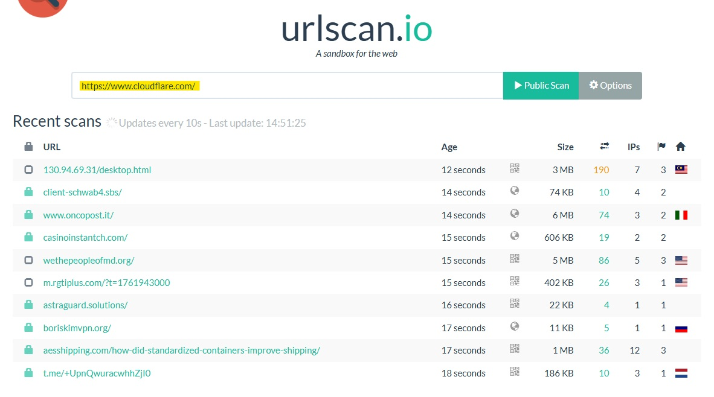
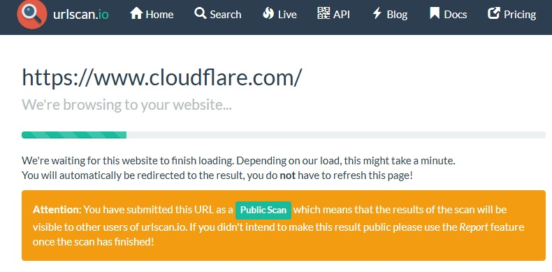
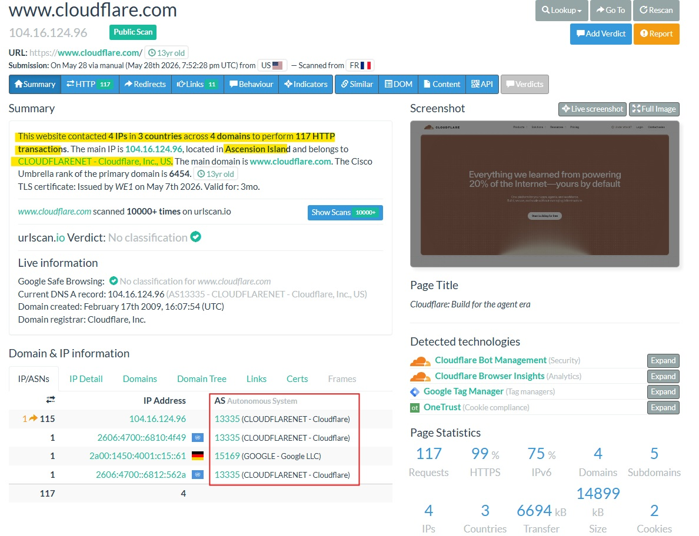
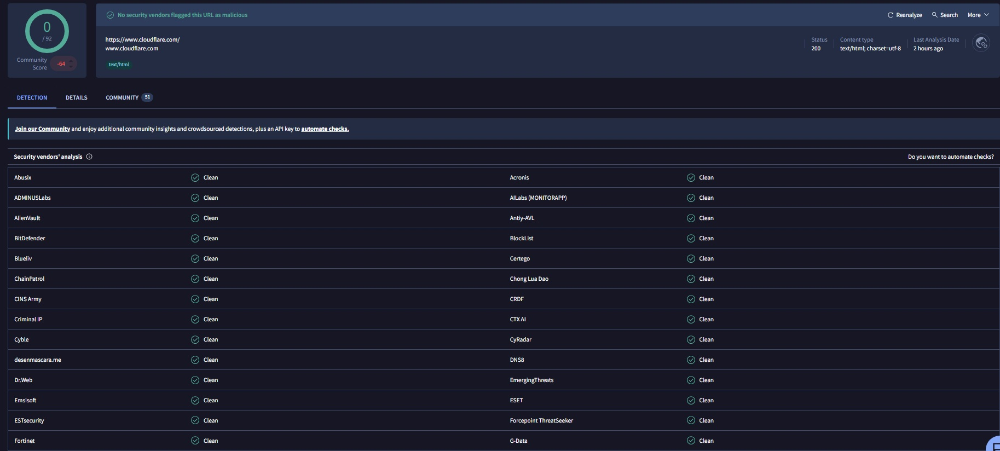
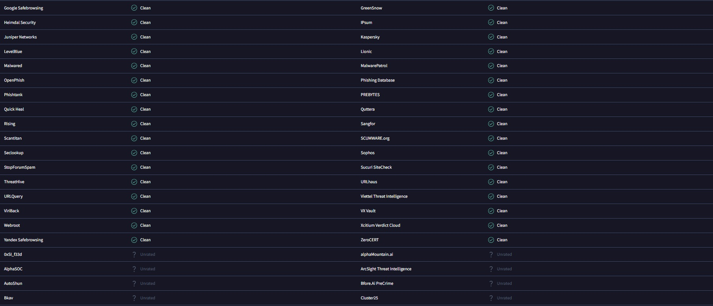

# 05 - URL Analysis

```markdown
<p align="center">
  
</p>
```

## Objective

The objective of this section is to analyze a public URL associated with the target domain using urlscan.io.

URL analysis helps cybersecurity analysts understand how a webpage behaves when visited in a controlled scanning environment. This can include reviewing contacted IP addresses, HTTP transactions, redirects, loaded domains, detected technologies, certificates, screenshots, and reputation verdicts.

## Why This Matters

In SOC triage and phishing investigations, analysts often need to investigate suspicious URLs without directly browsing to them from a corporate endpoint.

URL analysis tools can help analysts:

- Safely review webpage behavior
- Identify contacted IP addresses and domains
- Review HTTP transactions and redirects
- Check whether a URL is classified as malicious or suspicious
- Capture a screenshot of the rendered webpage
- Identify technologies used by the site
- Support phishing and malware triage decisions

## Tool Used

```text
urlscan.io
```

## Target Queried

```text
https://www.cloudflare.com/
```

## Screenshot 1 - URLScan Search



The URL `https://www.cloudflare.com/` was submitted to urlscan.io as a public scan.

## Screenshot 2 - URLScan Browsing Status



After submission, urlscan.io loaded the website in its sandbox environment and generated a public scan result.

## Screenshot 3 - URLScan Summary Results



### Key Observations

| Field | Finding |
|---|---|
| URL | https://www.cloudflare.com/ |
| Main Domain | www.cloudflare.com |
| Main IP | 104.16.124.96 |
| ASN | AS13335 - CLOUDFLARENET |
| Registrar | Cloudflare, Inc. |
| Domain Created | February 17, 2009 |
| urlscan.io Verdict | No classification |
| Google Safe Browsing | No classification |
| HTTP Transactions | 117 |
| Contacted IPs | 4 |
| Countries Contacted | 3 |
| Domains Contacted | 4 |
| Page Title | Cloudflare: Build for the agent era |

### Detected Technologies

The scan identified several technologies associated with the webpage:

| Technology | Category |
|---|---|
| Cloudflare Bot Management | Security |
| Cloudflare Browser Insights | Analytics |
| Google Tag Manager | Tag Management |
| OneTrust | Cookie Compliance |

### Analyst Notes

The urlscan.io results showed that `https://www.cloudflare.com/` loaded successfully and did not receive a malicious classification from urlscan.io or Google Safe Browsing at the time of the scan.

The main IP address observed was `104.16.124.96`, which belongs to AS13335, Cloudflare's autonomous system. This is consistent with the earlier DNS and IP reputation findings that showed Cloudflare-owned infrastructure.

The scan also showed that the website contacted multiple IPs, countries, and domains while loading. This is common for modern websites that use analytics, consent management, security controls, and content delivery infrastructure.

The detected technologies are also consistent with a legitimate enterprise website. Cloudflare Bot Management and Cloudflare Browser Insights align with Cloudflare's own security and analytics services, while Google Tag Manager and OneTrust are common third-party tools used for tag management and cookie compliance.

From a SOC perspective, URLScan is valuable because it allows analysts to inspect URL behavior without directly visiting the site from a corporate endpoint. It provides a safe way to review webpage rendering, network connections, technologies, and reputation context.

In this case, the URL analysis supports the conclusion that `https://www.cloudflare.com/` is legitimate Cloudflare infrastructure and does not show suspicious classification indicators in the captured results.

## VirusTotal URL Analysis

After reviewing the URL in urlscan.io, VirusTotal was used to check the public reputation of `https://www.cloudflare.com/`.

VirusTotal aggregates URL reputation results from multiple security vendors. In SOC triage, this can help analysts quickly determine whether a URL has been flagged as malicious, suspicious, phishing-related, or clean by participating vendors.

## Tool Used

```text
VirusTotal
```

## Target Queried

```text
https://www.cloudflare.com/
```

## Screenshot 1 - VirusTotal URL Detection Summary



### Key Observations

| Field | Finding |
|---|---|
| URL | https://www.cloudflare.com/ |
| Domain | www.cloudflare.com |
| Detection Ratio | 0 / 92 |
| Vendor Result | No security vendors flagged this URL as malicious |
| HTTP Status | 200 |
| Content Type | text/html; charset=utf-8 |
| Last Analysis | Recently analyzed at the time of investigation |

## Screenshot 2 - VirusTotal Vendor Analysis



The vendor analysis showed that the visible security vendors marked the URL as clean or unrated. No malicious detections were observed in the captured results.

## Analyst Notes

The VirusTotal review showed that `https://www.cloudflare.com/` was not flagged as malicious by any participating vendors in the captured results.

The `0 / 92` detection ratio supports the earlier urlscan.io findings, which also showed no suspicious classification for the Cloudflare website.

From a SOC perspective, URL reputation checks are useful during phishing, malware, and suspicious link investigations. However, reputation tools should be treated as supporting evidence rather than final proof. A clean reputation result does not guarantee that a URL is always safe, especially if the page changes later or if the suspicious activity depends on redirects, geo-targeting, user-agent filtering, or credential-harvesting behavior that does not appear during automated scanning.

In this case, VirusTotal supports the conclusion that the reviewed Cloudflare URL appears legitimate and does not show malicious reputation indicators at the time of analysis.

